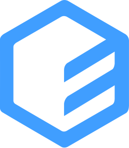

# Javier Ramos Nistal (@JaviRamosLab)

## About my

**Designer | FullStack Developer (junior) | Marketer | Translator | Wikipedian**

I am wikipedia admin, translator (esperanto), designer (web/graphic/editorial), web editor/administrator, developer (backend/frontend) and vicpresident of Wikimedia Esperanto. Developer for ILERA (Ham Radio Organization), Cuba Esperanto-Association and open source contributor. I love work with APIs, users stats, graphics, maps, databases and interactions. I also have experience with wikis, blogs, documentation, AdminLTE, API, AJAX, CRUD, Fetching, scraping, crawling, oAuth, Tokens, JWT, architecture MVC, POO, Progressive Web Apps (PWA), Single Page Application (SPA), DataBases and schemas (SQL and NoSQL), Countdown + clocks, Hosting + servers + VPS, Performance, Accessibility, UX/UI, Telegram Bots, Data Analytics/Data Science, Google Analytics, metrics, KPI, domain naming, SEO/SEM, Marketing Tools, Social Media, QR Codes, e-commerce (Shopify/WooCommerce), productivity, time management, diagraming (mermaid, scalidraw), Working with Files and more...

**I love learn and experiment!**

---

### Vue ecosystem lover

.........

container - box - 
flex - grid - 
column - row

    
        
        Vue
    
    
        
        vue-use
    

-

### Productivity

### Education

-----edteam-----

### Office

### Translation

-----weblate-----

### Bloging

### Analytics

 + ...

### IDE

### OS

### Web Browsers

### Cripto/Blockchain

<!--  -->

### Funding

-->**not at the moment**<--

### Contact

<!--  --><!--  -->
<!--  -->

### Social

<!--  -->

---

## 🏆 GitHub Trophies

---

## 📈 My Stats

    <!-- Contribution Heatmap with Snake Animation -->
    
    
    <!-- Github Activity Graph -->
    
    
    <!-- Github Streak Stats -->
    
    

---

---

  

---

## Roadmap

  

---

## 🚀Github Metrics

## 📈 My Streak Stats:

<!-- Footer -->
<samp>
    

        ════════════ ⋆★⋆ ════════════
        ════════════ ⋆★⋆ ════════════
         
        "Happy Coding👨💻"
    

</samp>

  
  
  

### Show some ❤️ by starring some of the repositories!

### Created with ❤️ in 🇨🇺 Cuba by @JaviRamosLab

Visitors Count 

